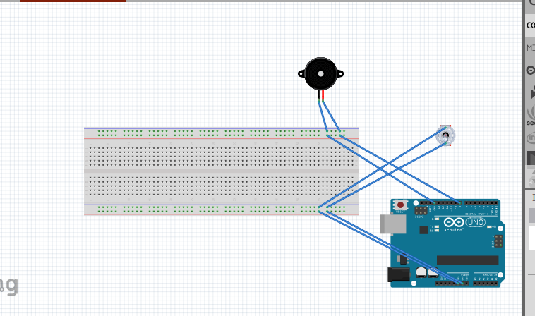

# P00: A Light Hearted Book

**Author(s)**: Brian Cox and Kaleb Robinson

**Google Document**: https://docs.google.com/document/d/1FxUdqYAApktBjegVLewhbV0h1axUhUuKEqjMwdc3cTM/edit?usp=sharing

---
## Purpose

We want to create a system that will alert the user that they havent flipped a page in a while. 
Reminding them to read more and in a timly manner. This system will include a feather/very sensitive
switch to sense when a page is being turned. It will then reset a timer that after five minutes of no 
flipping pages(detected using the switch) will sound a loud and annoying buzzer until the user reads more.
You stop the gizmo by disabling its power source.

## Initial Design Plan

Outline:
- Parts: Arduino for the board, buzzer, Feather switch
- Parts of code:
  -Loop of timer
  -while statement that checks when the switch is flipped
  -buzzer will sound if not flipped
  -initial setup
  

**Feather Book**:

## Files

- images: showing all the images needed for documentation and showing how it will be made
- licence: All the copy right stuff
- Tester_time: we used this to test the ChronoDot to understand it
- Loop_Melody: use to understand how to use the buzzer
- ReadMe: all the documentation and information of the project
- Project_1.ino: Where we will be adding the code to make the project work
- ReaMeExample: how to do the ReadMe on our project

## References
- how to attach clock: https://www.instructables.com/id/Arduino-Aquaponics-Real-Time-Clock-Part-I/ 
- sample time library: https://github.com/PaulStoffregen/Time 
- main time code example: http://docs.macetech.com/doku.php/chronodot_v2.0 
- Showed us how to wire uo the Mirco Switch: https://www.youtube.com/watch?v=6wuInF9Yw08 

## Summary
We decided to create a a device that will alert the user that they need to
turn the page of the book they're reading. So that they are reading in a 
timely fashion of five minutes. As the page turns it will activate the 
Micro Switch and then reset the clock. It will sound a buzzer after
five minutes if inactivity. Our initail design is quite similar to our 
product. We spent a great amount on this, more so Kaleb since he worked 
on it more outside of class. The most trouble we had with it was with the
ChronoDot. We could had a lot of troule trying to get it to reset. 
Other than that we didn't have that much trouble in this project.

## Instructions
Once the code it uploaded it will start the clock. Or press the small button
on the Ardarino to reset the clock. Once it is reseted it will sound a
buzzer after five minutes. The only way the buzzer goes off/won't go off is if 
the Miro Swithc is flipped before or after the five minutes. This will then
reset the clock. This will keep you reading and flipping the page in a 
timely manner. 

## Errors and Constraints
- we can only change the timer length by editing the code. 
- The ChronoDot is very difficult manipilating the time

## Reflection

Brian: This project was my idea in the begining since I was
reading for a class. I learned how to use the buzzer outside 
of the original project we used it in. It was frustrating 
trying to understand the ChronoDot and how it worked into 
the code. 

As we make more and more projects I am also getting a better 
understanding of how the bread board works and all the wiring
too. This will also help in the TAD class Computer Science 
Majors need. I also have a better understanding of how the 
Arduino language is and works. 

Kaleb:

Write 2 - 4 paragraphs on your reactions to the final project. 
Your reflection should be thoughtful and reflective. 
It is NOT a report about WHAT you did. 
Instead, it's a look back at what you learned by doing this project.
It should be critical of shortcomings (yours, as well as the instructors/assignments) 
as well as celebratory of what was achieved.

## Final Self-Evaluations

### Ideation, Brainstorming, Design:

*Brian: 6*

*Kaleb: 4*

### Code creation: 

*Brian: 3*

*Kaleb: 7*

### Documentation creation:

*Brian: 7*

*Kaleb: 3*

### Teamwork & Participation:

*Brian: 5*

*Kaleb: 5*
